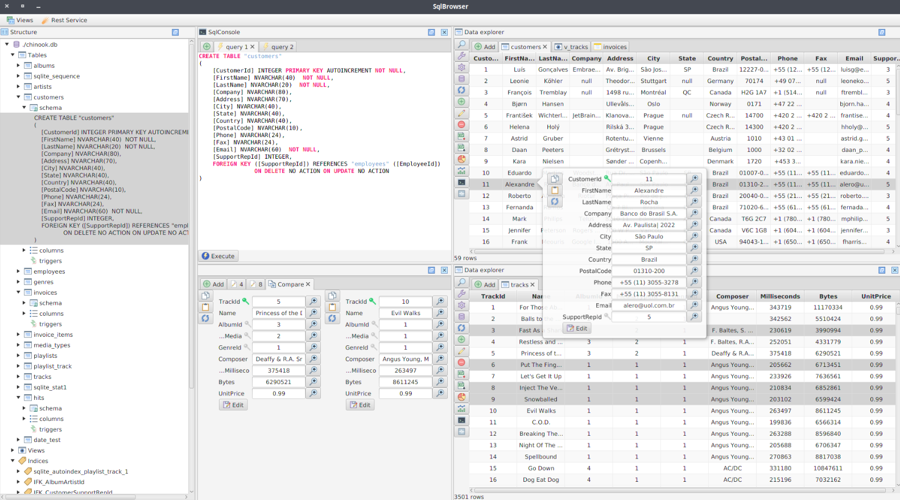

# SqlBrowserFX

SqlBrowserFX is a feature rich cross platform sql client for SQLite , MySQL for both windows and linux 

### Features

* Manage data (insert, update, delete) via gui.
* Execute raw sql queries.
* Editor for sql with syntax highlighting, autocomplete features.
* Adjustable responsive ui.
* Graphical representation of database as tree.
* Exposure of database to the web as RESTful service with one click.
* Import, export csv files.
* Queries History.
* Savable queries.
* Support for SQLite.
* Support for MySQL.
* Cross Platform.

### Prerequisites

* JDK 8 with JavaFX like oracle jdk 8 or zulufx 8.
* MySQL server for usage with mysql.

### Installing

Copy sqlbrowser-for-build.db to sqlbrowser.db.
Import the project to your favorite ide as maven project and run SQlBrowserFXApp class.
You can also run install.sh script , if you are using linux in order to install sqlbrowserfx as cli command
'sqlfx'.

### Build standalone app

Run build.sh script, this will generate all files needed in 'dist' folder.
Run SqlBrowserFX.exe for Windows, or run sqlbrowserfx.sh for Linux.

## Awesome projects used

* [DockFX](https://github.com/RobertBColton/DockFX) - The docking framework used (a moded version actually).
* [RichTextFΧ](https://github.com/FXMisc/RichTextFX) - Library which provides editor with syntax highlighting feature.
* [ControlsFX](https://github.com/controlsfx/controlsfx) - Library which provides many useful custom gui components.
* [Spark Java](https://github.com/perwendel/spark)  - The web framework used.

