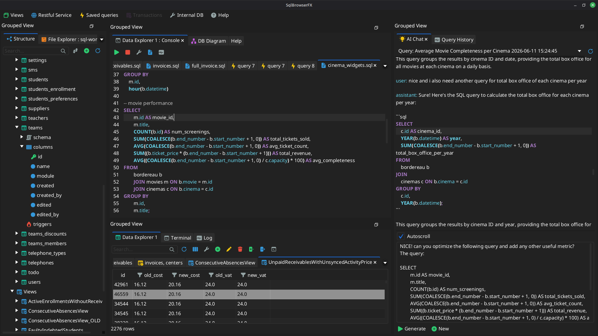

# SqlBrowserFX

SqlBrowserFX is a feature-rich cross-platform SQL client for SQLite, MySQL, MariaDB, and partially supports PostgreSQL, MSSQL.

**NEWS:** 🤖 SqlBrowserFX now has AI capabilities through the utilization of ollama API! All you need is an ollama installation and your preferred model!



### Features

* **Manage Data:** Easily insert, update, or delete data using a user-friendly GUI.
* **Execute Queries:** Run raw SQL queries directly from the client.
* **Syntax Highlighting:** Benefit from syntax highlighting for SQL and Java code.
* **Drag-and-Drop Editing:** Edit SQL and Java files by simply dragging and dropping them into the editor.
* **Responsive UI:** Enjoy a flexible, responsive interface that scales to accommodate multiple views.
* **Database Tree Representation:** Visualize your database as a hierarchical tree.
* **ERD Diagram:** Generate Entity-Relationship Diagrams (ERDs) for better understanding of your database schema.
* **Web Exposure:** Expose your database as a RESTful web service with just one click.
* **CSV Import/Export:** Easily import and export data in CSV format.
* **Query History:** Access previously executed queries for quick reference.
* **Files Manager:** Navigate through project files using a tree manager.
* **Search Functionality:** Quickly find specific files within your project.
* **Savable Queries:** Save frequently used queries for easy access later.
* **Support Multiple Databases:** Connect to SQLite, MySQL, MariaDB, PostgreSQL, and MSSQL (partial support).
* **Cross-Platform:** Use SqlBrowserFX on Windows, Linux, and macOS.
* **Custom Themes:** Choose between Dark and Light themes to customize your interface.

### Prerequisites

* Java 25+
* Installation of the desired database.

### Installing

Copy `sqlbrowser-for-build.db` to `sqlbrowser.db`.
Import the project into your favorite IDE as a Maven project and run the `GUIStarter` class.
You can also run the `install.sh` script if you are using Linux to install SqlBrowserFX as a CLI command: `sqlfx`.

### Compatibility with Older Versions of Java

* Tag 3.12.0 -> Java 21
* Tag 2.5.0 -> Java 17
* Tag 1.5.0 -> Java 8

### Build Standalone App

Run the `build.sh` script to generate all necessary files in the `dist` folder.
Run `SqlBrowserFX.exe` for Windows or `sqlbrowserfx.sh` for Linux.

### Build Fat Jar

Run the `build-fat.sh` script to generate a fat jar.
Run it ```java -jar sqlbrowserfx-<version>-fat.jar```

## Awesome Projects Used

* [DockFX](https://github.com/RobertBColton/DockFX) - The docking framework used (a modified version).
* [RichTextFX](https://github.com/FXMisc/RichTextFX) - Library providing editor with syntax highlighting.
* [ControlsFX](https://github.com/controlsfx/controlsfx) - Library for many useful custom GUI components.
* [Javalin](https://github.com/tipsy/javalin) - The web framework used.
