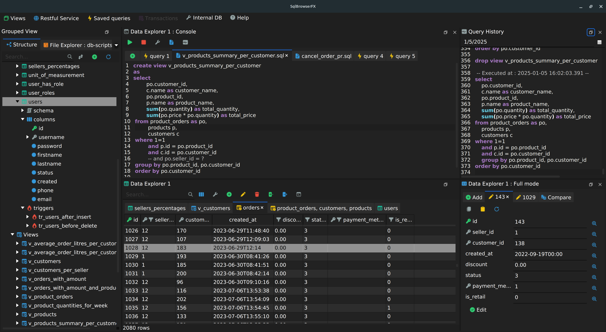

# SqlBrowserFX

SqlBrowserFX is a feature rich sql client for SQLite , MySQL.




## Getting Started

These instructions will get you a copy of the project up and running on your local machine for development and testing purposes. See deployment for notes on how to deploy the project on a live system.

### Prerequisites

JDK 8 with JavaFX like oracle jdk 8 or zulufx 8.

```
Give examples
```

### Installing

Import the project to your favorite ide as maven project and run SQlBrowsrApp class.

```
Give the example
```

And repeat

```
until finished
```

### Build standalone app

Run build.sh script, this will generate all files needed in 'dist' folder.
Run sql-browser.exe for Windows, or run sqlbrowser.sh for Linux.


## Libraries used

* [DockFX](http://www.dropwizard.io/1.0.2/docs/) - The web framework used
* [Spark java](https://maven.apache.org/) - Dependency Management


## Authors

* **Billie Thompson** - *Initial work* - [PurpleBooth](https://github.com/PurpleBooth)

See also the list of [contributors](https://github.com/your/project/contributors) who participated in this project.


